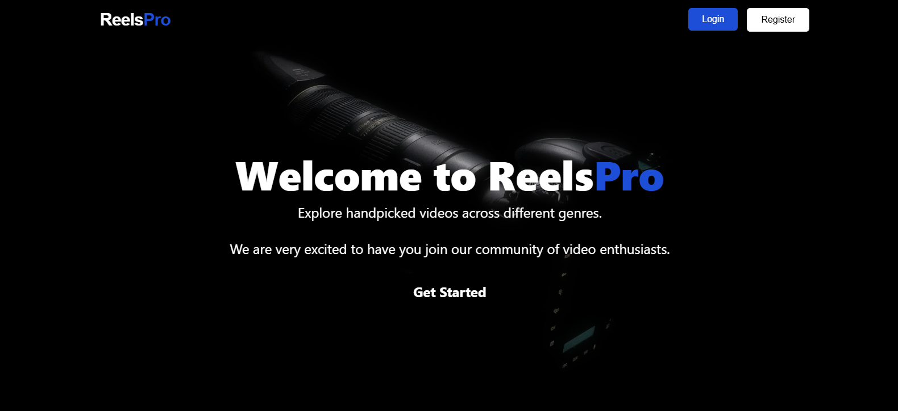

# ReelsPro

## 📌 Project Overview

🎬 About ReelsPro
ReelsPro is a platform where users can share and watch short videos. It also has a computer program that can talk to users and help them, and a system to check videos for bad content. The website is designed to be fun and easy to use, and to help people connect with each other through their videos.

## 🖼️ Preview



## 🚀 Features

- **User-friendly interface** for seamless feedback submission
- **Upload and rendering videos** using Imagekit
- **AI Chatbot** powered by Groq and Vercel AI SDK for assistance.
- **Conceptual AI Content Moderation** with providers like Gemini and Groq.
- **Mobile-responsive design** ensuring accessibility across devices
- **Optimized performance** with server-side rendering (SSR) and static site generation (SSG)
- **Modern UI** powered by Tailwind CSS and Shadcn, magicui
- **Secure API interactions** for data integrity

## 🔗 Live Demo

Check out the live version of ReelsPro here: [Live Site](https://reelspro-phi.vercel.app/)

## 📹 Demo & Presentation

### YouTube Videos

#### Part 1 Presentation
<a href="https://youtu.be/V4u56VDxRTY?si=J6-sYgl_rch84l6B" target="_blank">
  
</a>
[Watch on YouTube](https://youtu.be/V4u56VDxRTY?si=J6-sYgl_rch84l6B)

#### Part 2 Presentation
- [Watch the part 2 presentation on YouTube](https://youtu.be/b4--EaAh6wA?si=42foofFVH0_qq_sp)


### LinkedIn Post
Check out our project announcement on LinkedIn:
[](https://www.linkedin.com/posts/abhay-gupta-197b17264_id8devhub-microsoft-hacksrit-activity-7327716169660989440-rhot?utm_source=share&utm_medium=member_desktop&rcm=ACoAAEDzBUMBKPskMR9oZcihJfH1ggERikM-aeo)

## 🛠 Installation & Setup

To set up and run the project locally, follow these steps:

### Prerequisites

Ensure you have the following installed:

- **Node.js** (Latest LTS version recommended)
- **npm** or **yarn** for package management

1. **Configure environment variables:**
   Create a `.env` file in the root directory and define the necessary environment variables:
   ```sh
   NEXT_PUBLIC_PUBLIC_KEY=<your-imagekit-next-api-key>
   IMAGEKIT_PRIVATE_KEY=<your-imagekit-private-api-key>
   NEXT_PUBLIC_URL_ENDPOINT=<your-imagekit-url-endpoint>
   GROQ_API_KEY=<your-groq-api-key>
   GROQ_API_MODEL=<your-groq-api-model>
   ```
2. **Run the development server:**
   ```sh
   npm run dev  # or yarn dev
   ```
3. Open `http://localhost:3000` in your browser to view the application.

## 🔧 Configuration

The application uses environment variables to manage API endpoints and database connections. Update the `.env` file accordingly to ensure smooth functionality.

## 📂 Project Structure

```
reelsPro/
   ├──app/
       ├── api/        # API routes (e.g., chatbot)
       ├── components/ # Reusable custom made components
       ├── admin/      # Admin specific pages (moderation, settings)
       ├── (main)/     # Main application pages (about, contact, services, privacy)
       ├── layout.tsx   # Layout page
       ├── page.tsx     # Actual Landing Page
   ├──components/      # Reusable UI components from shadcn and magicui
   ├──data/            # Data used at various places
   ├──lib              # Utilities
   ├── public/            # Static assets (images, icons, etc.)
   ├── next.config.ts     # Next.js configuration settings
   ├── package.json       # Project metadata and dependencies
   ├── .env.local         # Environment variables (excluded from Git) - Recommended for local development
   ├── .env               # Environment variables (excluded from Git) - General fallback
```

## 🏰 Technologies Used

- **Next.js** - React framework for SSR & SSG
- **TypeScript** - Ensures type safety and scalability
- **Imagekit** - Uploading and management of videos using imagekit
- **Groq API & Vercel AI SDK** - Powering the AI Chatbot
- **Tailwind CSS** - Utility-first CSS framework for rapid styling
- **ESLint & Prettier** - Code linting and formatting for better maintainability
- **React-hook-form** - All forms are managed using React Hook Form
- **Shadcn** - Responsive and clean UI with help of Shadcn

## 👨‍💻 Team - TechMatrix Solvers

This project was developed as part of the [HacksRIT Hackathon](https://unstop.com/hackathons/hacksrit-shri-ram-group-of-institutions-jabalpur-1471613) by:

- **Kripanshu Gupta** (2022-2026) - MERN Stack Developer

  - [LinkedIn](https://www.linkedin.com/in/kripanshu-gupta-a66349261/)

- **Abhay Gupta** (2022-2026) - ML & Full-Stack Developer

  - [LinkedIn](https://www.linkedin.com/in/abhay-gupta-197b17264/)

- **Jay Kumar** (2022-2026) - ML & Front-end Developer

  - [LinkedIn](https://www.linkedin.com/in/jay-kumar-jk/)

- **Simran Koshta** (2023-2027) - Full Stack Developer
  - [LinkedIn](https://www.linkedin.com/in/simran-koshta-40b3b2289/)

## 🌟 Future Integrations

What makes ReelsPro different from existing platforms:

- WITHOUT Fear of Shame daily Vlog Upload. No Explicit Content
- Deep AI integration: automatic tagging, moderation, and feed personalization, unlike most platforms that offer only basic AI features
- Seamless drag-and-drop uploads and real-time media optimization via ImageKit, reducing load times and manual steps
- Platform-agnostic backend for developers to build custom video apps, not just a consumer-facing social feed
- Serverless, scalable deployment for cost-effective growth
- Focus on actionable analytics and future monetization support for creators, beyond simple content sharing

## 🤝 Contributing

We welcome contributions to enhance the project! To contribute:

1. Fork the repository.
2. Create a new branch (`feature/your-feature-name`).
3. Implement your changes and commit.
4. Push to your forked repository and submit a pull request.
